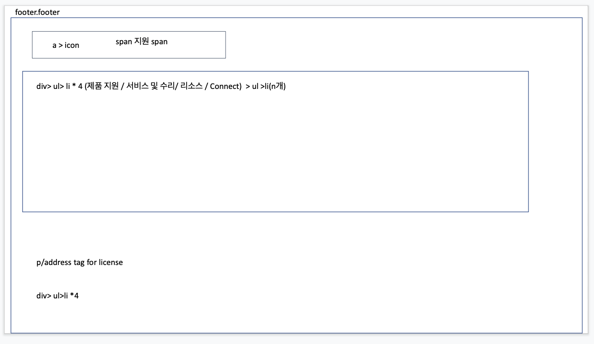

# Draft 2

 

## 간략한 회의록 

 

👉 오늘 회의에서는 팀원들과 `footer.footer`부분까지 대략적으로 HTML을 어떤 구조로, 어떤 태그를 사용하여 구성할 것인지에 대해 고민하는 시간을 가져보았다.  

👉 이번 주말까지 각 팀원들은 `#Draft1`과 `#Draft2`를 토대로 각자만의 HTML을 짜와서 어떠한 근거로 구조를 그렇게 짰는지 설명하는 시간을 갖고, 다음주에는 CSS를 활용하여 레이아웃을 잡고자 한다. 

 

