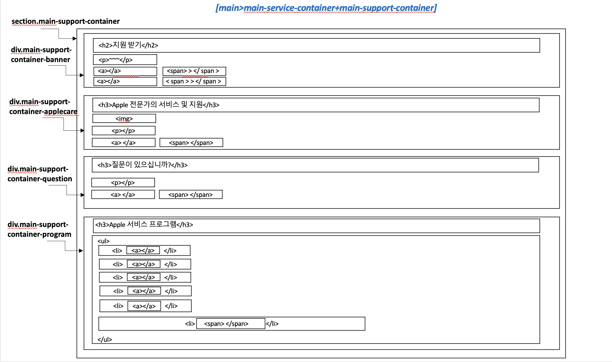

# Draft 3

 

## 간략한 회의록 

 

👉 오늘 회의에서는 팀원들과 main 섹션의 두 번째 섹션인 `main-support-container`부분까지 대략적으로 HTML을 어떤 구조로, 어떤 태그를 사용하여 구성할 것인지에 대해 고민하는 시간을 가져보았다.  

👉 돌아오는 주말까지 각 팀원들은 `#Draft1`, `#Draft2`, `#Draft3`를 토대로 각자만의 CSS 파일을 만들어 와서 어떠한 근거로 레이아웃를 그렇게 짰는지 설명하는 시간을 갖고, 주말에는 줌으로 만나서 레이아웃 이외의 디테일들을 조금 더 회의할 예정이다. 

 

## 오늘의 아이디어

<video style="width:100%" autoplay controls muted >
  <source src="./images/video.mp4" type="video/mp4">
	<source src="./images/video.webm"
            type="video/mp4">
  애플 고객지원 사이트 클론 - 문제점 발견 관련 동영상 
</video>

<!-- <video style="width:100%" controls preload="auto">
  <source src="video.mp4" type="video/mp4">
Your browser does not support the video tag.
</video> -->

👉 애플 공식 지원 페이지에서 뷰포트를 작게 했을 때는 나타나지 않는 문제점이지만, 뷰포트를 크게 했을 때는 위의 비디오에서 확인할 수 있듯이 가시적으로 보이는 텍스트 영역에 비해 실제로 clickable 한 영역이 다소 넓어서 사용자가 실수로 클릭하여 다른 페이지로 넘어갈 수 있다는 문제점이 제기되었다. 

👉 해서, 개선 사항으로 가시적으로 텍스트 영역이라고 보여지는 부분과 실제로 클릭이 가능한 영역을 똑같이 설정을 하자는 의견이 나왔다. 

<!-- 👉 애플 공식 지원 페이지에서 뷰포트를 작게 했을 때는 나타나지 않는 문제점이지만, 뷰포트를 크게 했을 때는 우리 draft의 h2에 해당하는 “지원 받기”의 하위 div들에 포함되어져 있는 a 태그로 감싸졌을 것이라고 예상되는 “~~~~ >” 영역이 … 가시적으로 보이는 텍스트 영역에 비해 실제로 클리커블한 영역이 다소 넓음 -> 개선 사항으로 가시적으로 텍스트 영역이라고 보여지는 부분과 실제로 클릭이 가능한 영역을 똑같이 설정을 하자는 의견이 나옴!  -->

 

