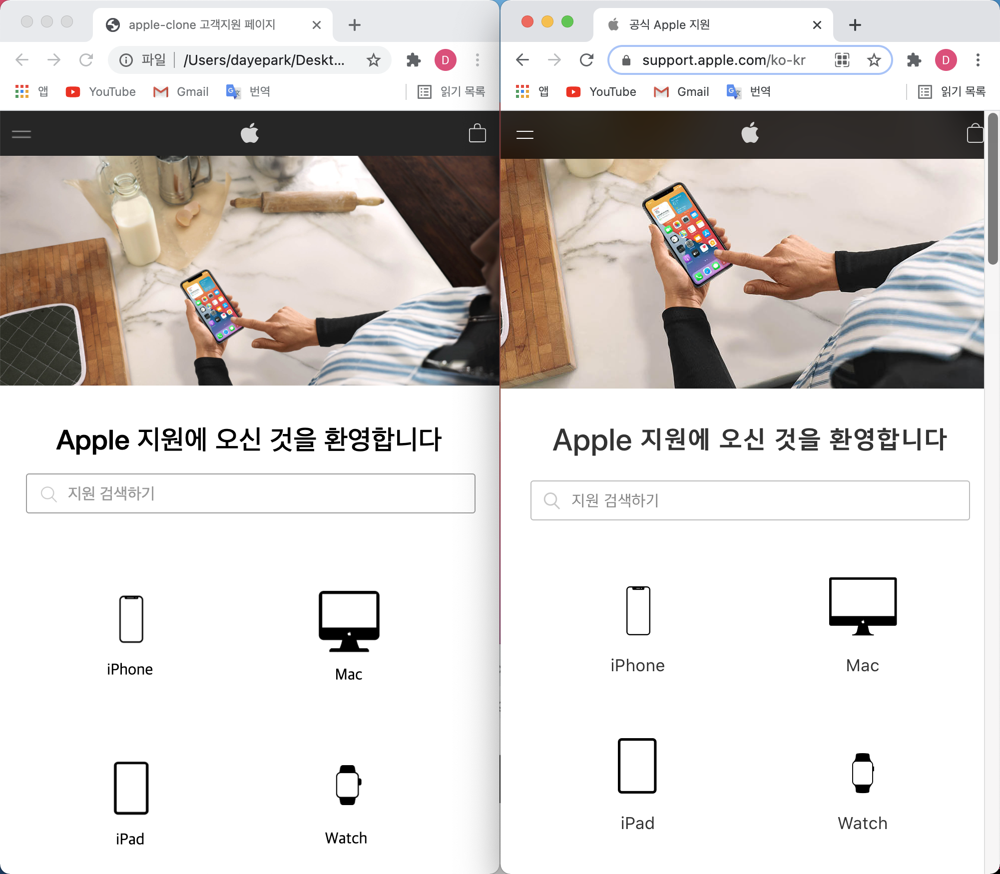
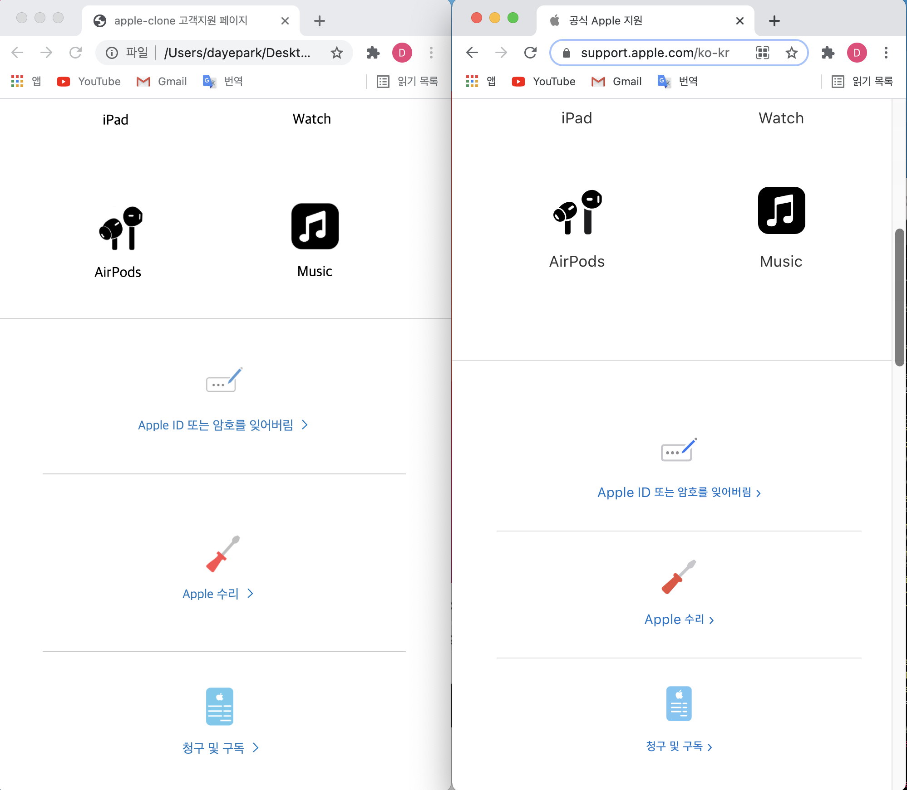
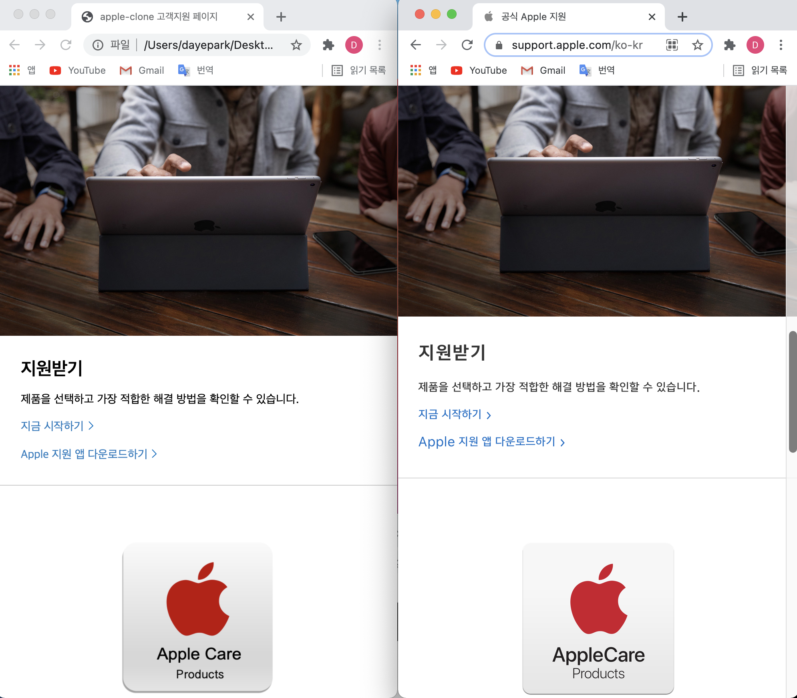
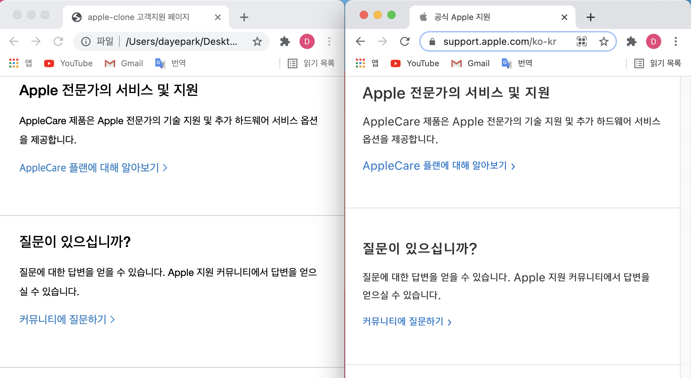
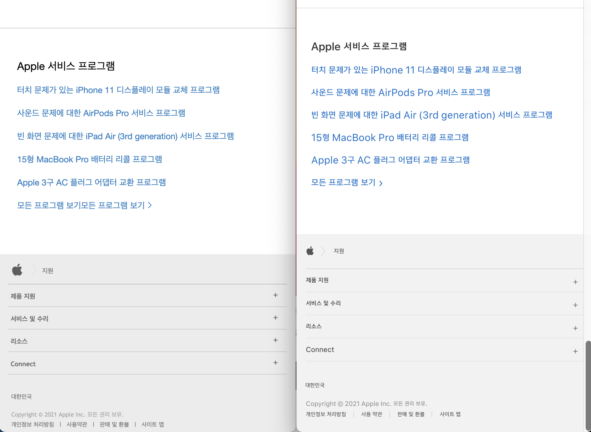

# Draft 4 - 중간점검

👉 오늘은 애플 클론 고객 지원 페이지 레이아웃과 관련하여 개인별로 준비한 HTML 및 CSS 코드를 팀원들끼리 리뷰하는 시간을 가졌다.   

👉 이런 코드 리뷰 시간을 통해 각자 어떠한 근거로 해당 HTML 태그 또는 CSS 속성을 사용했는지 팀원들에게 설명하는 시간을 갖고, 부족한 부분을 좀 더 나은 방향으로 고쳐가는 매우 생산적인 회의 시간을 가졌다. 이런 훈련은 앞으로 우리가 개발자로서 실무에서 필수적으로 요구되는 협업 방법을 간접적으로 경험하는 기회가 되었다고 생각된다.   

👉 오늘 개인에게 다른 팀원들이 보충하면 좋겠다고 얘기를 나눈 코드를 돌아온는 주말까지 보완하도록 하고, 오늘 끝내지 못한 코드 리뷰를 추가적으로 진행하기로 하였다.  
(cf. 담주까지 각 팀원들이 해야할 부분은 ["Todos by next meeting"]이란 제목으로 깃허브 issues에 올려놓았다.)

["Todos by next meeting"]:https://github.com/ekfka4863/apple-clone/issues/8

 

## 오늘 중간점검한 팀원들의 결과물

 

- 중감점검 했을 때 애플 클론의 레이아웃 결과는 아래와 같다:   
	- 팀 감자탕이 구현한 애플 클론 고객 지원 페이지는 왼쪽이고, 원본은 오른쪽이다. 
	- 원본에 있던 "유사/모조품 주의" 색션은 구현하지 않았다. 

 

 

 

 

 

 

 

 

 

 

