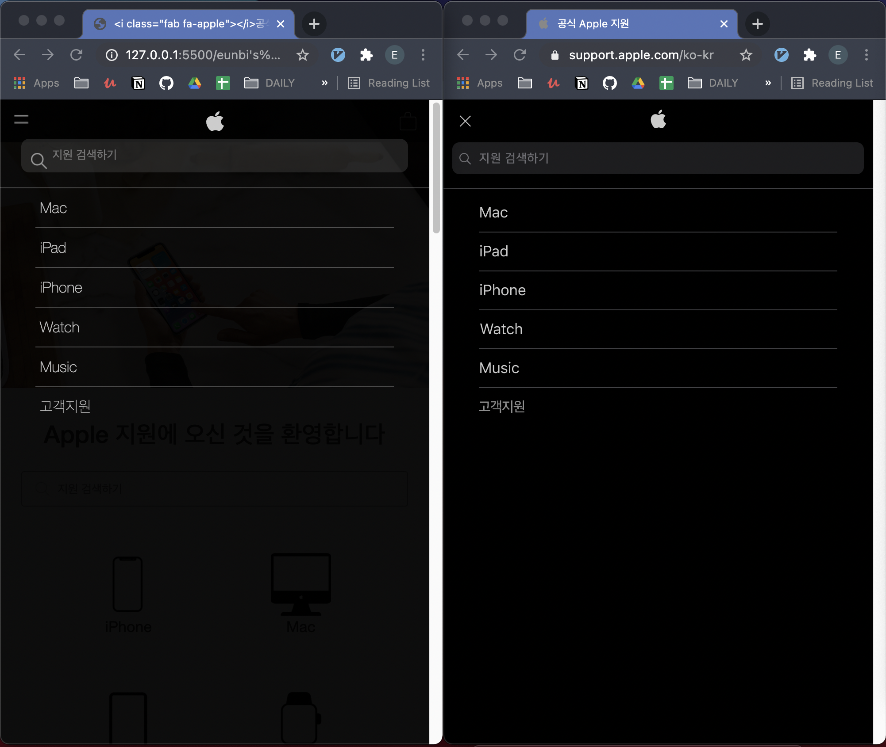
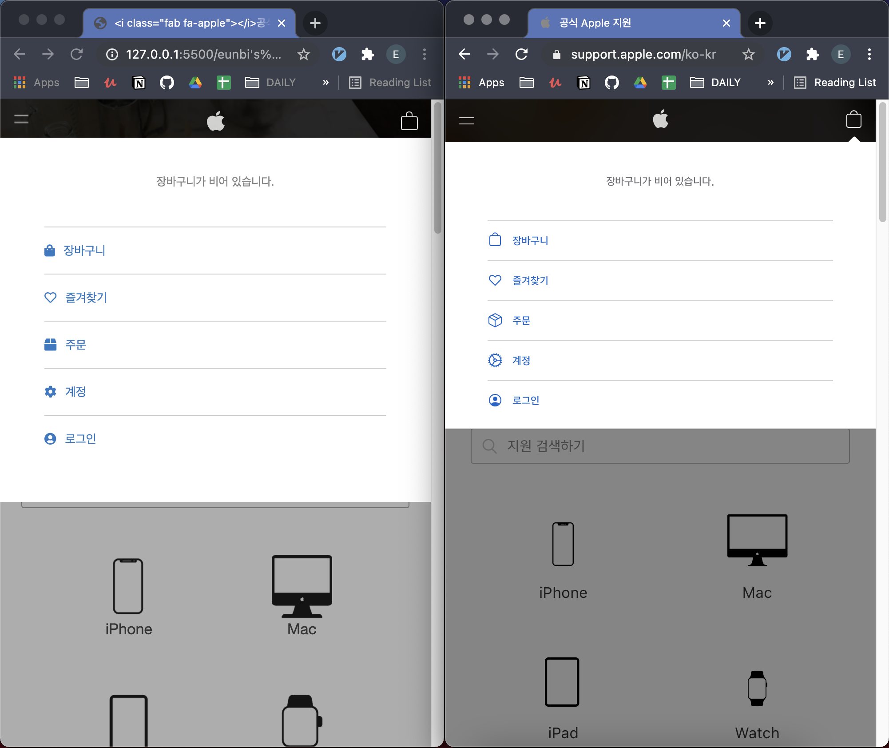

# Draft 5- html css 종합 후 네비게이션 메뉴에 javascript 이벤트 적용시키기

👉 오늘은 애플 클론 고객 지원 페이지 마크다운을 다시 한번 검토하고 종합하고 네비게이션 메뉴 버튼들에 자바스크립트 이벤트를 적용 시키는 시간을 가졌다.

👉 마크다운을 다시 한번 검토하면서 앞으로도 마크다운을 설계할 때 어떤 점들을 조금 더 주의깊게 생각하고 만들어야하는지 정리할수있었다. 같은 것을 보고 다양하게 다른 방법으로 구현할수 있는 아이디어를 모으고 장단점들을 이야기해보니 한가지 생각이나 방법으로 한정되지 않아서 더 재미있었다.

👉 다음 미팅(2021.04.27) 까지 학습 및 준비 해야할 부분은 ["Todos by next meeting"]이란 제목으로 깃허브 issues에 올려놓았다.

["Todos by next meeting"]:https://github.com/ekfka4863/apple-clone/issues/13

TODOS:
- .footer-header 부분 수정하기
- 사이드바 메뉴 중 햄버거바 애니메이션 입혀서 애플처럼 열리면 X로 표시되게 구현하기
- scroll to top 구현하기 위해서 DOM 과 이벤트 복습해오기
	- page offset과 scroll
	- 가능하면 디바운스와 스로틀도 준비해오기
	- 참고:
		- [Window.pageYOffset](https://developer.mozilla.org/ko/docs/Web/API/Window/pageYOffset)
		- [Window.scrollTo()](https://developer.mozilla.org/ko/docs/Web/API/Window/scrollTo)
		- [Window.scroll()](https://developer.mozilla.org/en-US/docs/Web/API/Window/scroll)

 

## 오늘 종합한 팀원들의 결과물

 

- 오늘 까지의 클로닝 결과는 아래와 같다:
	- 팀 감자탕이 구현한 애플 클론 고객 지원 페이지는 왼쪽이고, 참고한 원본 애플사이트는 오른쪽이다. 
	- 네비게이션 바에 햄버거 메뉴를 누르면 첫번째 사진과 같이 사이드바 메뉴가 열린다.
	- 네비게이션 바에 제일 오른쪽 쇼핑카트 버튼을 누르면 두번째 사진과 같이 쇼핑카트 관련 사이드바 메뉴가 열리고 메뉴 외에 공간은 조금 더 어두운 톤으로 보이게 처리 되었다.
	
 

 

 

 

 

 

